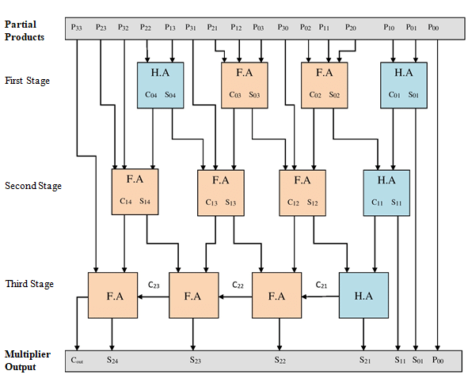
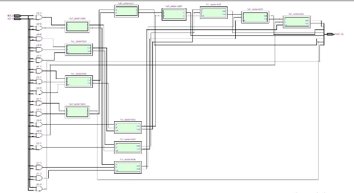
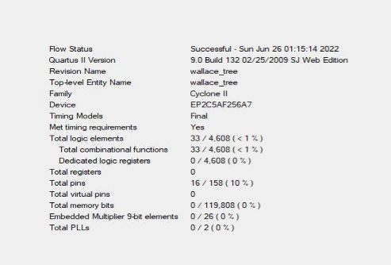
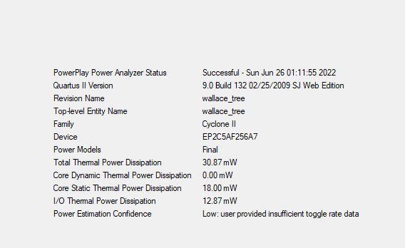
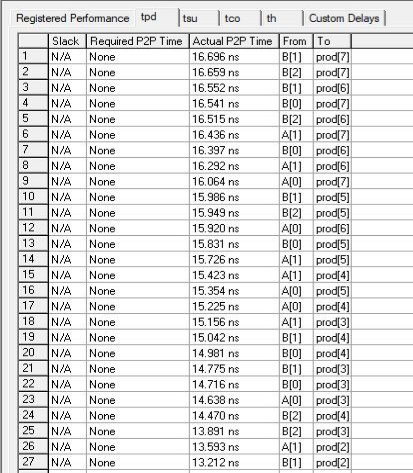
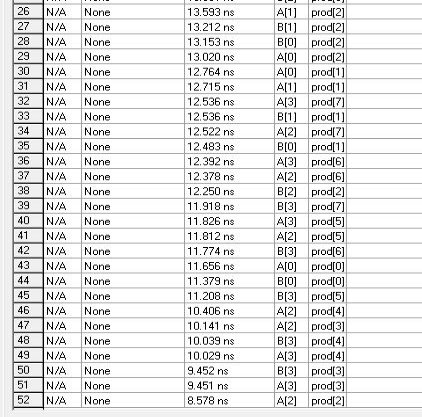
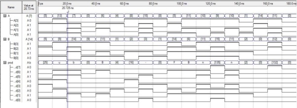

**DESIGN OF A  4X4 WALLACE TREE MULTIPLIER USING VERILOG HDL** 

A PROJECT REPORT

*Submitted by*

Abhinav R  2019504502

`  `Charaan S  2019504511

` `Sarath Vignesh A 2019504581

***In partial fulfilment for the award of the degree of***

# **BACHELOR OF ENGINEERING IN**
**ELECTRONICS AND COMMUNICATION ENGINEERING**

**DEPARTMENT OF ELECTRONICS ENGINEERING** 

**MADRAS INSTITUTE OF TECHNOLOGY 
ANNA UNIVERSITY: CHENNAI 600044**

**Introduction:-**

`		`Binary multipliers are digital circuits capable of multiplying two numbers. Many techniques involve computing the set of partial products, which are then summed together using binary adders in a process similar to long multiplication in binary format. Multipliers usually produce long delay so reducing it is critical. Wallace multipliers are fast multipliers compared to the easily accessible multipliers as they save addition bits in the algorithm for the final product addition. This project involves implementation of 4\*4 Wallace Multiplier using Verilog HDL.

**Software required:-**

`		`Altera Quartus II

**Theory:-**

Multipliers have gained significant importance with the introduction of the digital computers. Multipliers are most often used in digital signal processing applications and microprocessors designs. In contrast to the process of addition and subtraction, multipliers consume more time and more hardware resources. With the recent advances in technology, a number of multiplication techniques have been implemented for fulfilling the requirement of producing high speed, low power consumption, less area or a combination of them in one multiplier. Speed and area are the two major constraints which conflict each other. Therefore, it is the designer’s task to decide proper balance in selecting an appropriate multiplication technique as per requirements.

Parallel multipliers are the high speed multipliers. Therefore, the enhanced speed of the multiplication operation is achieved using various schemes and Wallace tree is one of them. There are three phases in the multiplier architecture:

1. The first phase is the generation of partial products.
1. Accumulation of partial product in second phase.
1. The third phase is the final addition phase.

The Wallace tree is a variant of long multiplication. The first step is to multiply each digit (each bit) of one factor by each digit of the other. Each of these partial products has weight equal to the product of its factors. The final product is calculated by the weighted sum of all these partial products. The first step, as said above, is to multiply each bit of one number by each bit of the other, which is accomplished as a simple AND gate, resulting in n2 bits, the partial product of bits am by bm has weight 2(m+n). In the second step, the resulting bits are reduced to two numbers; this is accomplished as follows: As long as there are three or more wires with the same weight, add a following layer:-

- Take any three wires with the same weights and input them into a full adder. The result will be an output wire of the same weight and an output wire with a higher weight for each three input wires.
- If there are two wires of the same weight left, input them into a half adder.
- If there is just one wire left, connect it to the next layer.

In the third and final step, the two resulting numbers are fed to an adder, obtaining the final product.

**

**Circuit Diagram:-**

**Code:-**

i) half\_adder.v

module half\_adder (a,b,s,c);

input a,b;

output s,c;

assign s = a^b;

assign c = a&b;

endmodule

ii) full\_adder.v

module full\_adder(a,b,cin,sum,cout);

input a,b,cin;

output sum,cout;

wire s0,c1,c2;

half\_adder ha1 (a,b,s0,c1);

half\_adder ha2 (s0,cin,sum,c2);

or(cout,c1,c2);

endmodule

iv) wallace.v

module wallace\_tree(A,B,prod);

`    `//inputs and outputs

`    `input [3:0] A,B;

`    `output [7:0] prod;

`    `//internal variables.

`    `wire s01,s02,s03,s04,s11,s12,s13,s14,s21,s22,s23,s24;

`    `wire c01,c02,c03,c04,c11,c12,c13,c14,c21,c22,c23,c24;

`    `wire [6:0] p0,p1,p2,p3;

//initialize the p's.

`    `assign  p0 = A & {4{B[0]}};

`    `assign  p1 = A & {4{B[1]}};

`    `assign  p2 = A & {4{B[2]}};

`    `assign  p3 = A & {4{B[3]}};

//final product assignments    

`    `assign prod[0] = p0[0];

`    `assign prod[1] = s01;

`    `assign prod[2] = s11;

`    `assign prod[3] = s21;

`    `assign prod[4] = s22;

`    `assign prod[5] = s23;

`    `assign prod[6] = s24;

`    `assign prod[7] = c24;

//first stage

`    `half\_adder ha01 (p0[1],p1[0],s01,c01);

`    `full\_adder fa02(p0[2],p1[1],p2[0],s02,c02);

`    `full\_adder fa03(p0[3],p1[2],p2[1],s03,c03);

`    `half\_adder ha04(p1[3],p2[2],s04,c04);

//second stage

`    `half\_adder ha11 (c01,s02,s11,c11);

`    `full\_adder fa12 (p3[0],c02,s03,s12,c12);

`    `full\_adder fa13 (c03,p3[1],s04,s13,c13);

`    `full\_adder fa14 (c04,p2[3],p3[2],s14,c14);

//third stage

`    `half\_adder ha21(c11,s12,s21,c21);

`    `full\_adder fa22(c12,s13,c21,s22,c22);

`    `full\_adder fa23(c22,s14,c13,s23,c23);

`    `full\_adder fa24(c23,p3[3],c14,s24,c24);

endmodule

**RTL Viewer**:-

**Flow Summary:-**

**Power Summary:-**

**Timing Summary:-**

**Simulation Waveform:-**

**Result:-**

Thus, Wallace tree has been designed using Verilog HDL in Altera Quartus II and its working has been checked along with flow analysis, timing analysis and power analysis. Simulation waveform has been attached.

